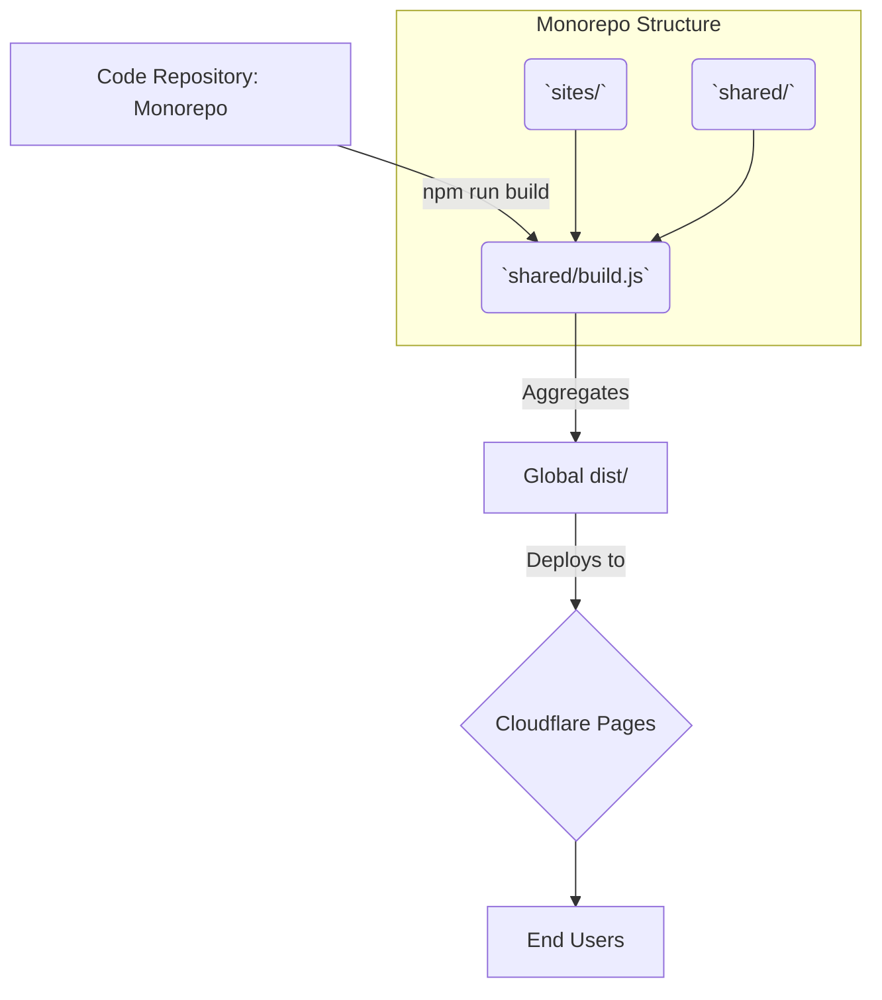

# Technical Architecture Document
## Overview
The platform leverages a scalable Static Site Generation (SSG) architecture custom-built via `build.js`, generating purely static HTML, CSS, and JS artifacts that hydrate instantly upon user load.

